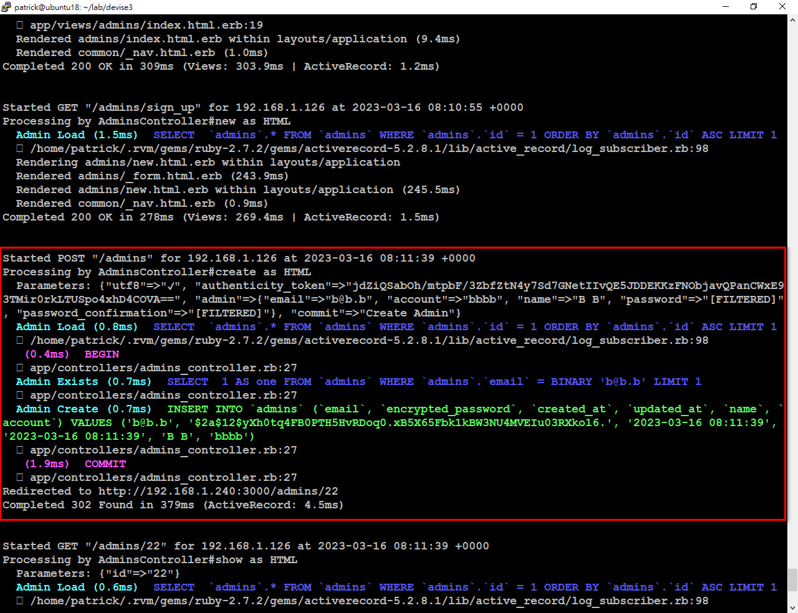

# ●客製化 Devise

<kbd>蘇介吾 2023/03/20</kbd>

* 目的：除了可以註冊、登入、登出外，還要增加列表清單、查詢、修改的功能。順便加入快速新增假帳號的功能（FfakerTW）。

## 1. 環境

```ruby
$ rvm list known

$ rvm install 2.7.7

$ rvm use 2.7.7

$ rvm gemset create rails5281

$ rvm use 2.7.7@rails5281 --default

$ ruby -v  #2.7.7

$ rails -v  #5.2.8.1

$ rails _5.2.8.1_ new  devise3 -d mysql

cd devise/

bundle lock --add-platform x86-mingw32 x86-mswin32 x64-mingw32 java
```

## 2. 安裝 

```ruby
$ vi Gemfile  #加入 
======================================
gem 'devise'
gem 'ffakerTW'
======================================

$ bundle  #安裝套件

$ rails g devise:install  #安裝 Devise 
=======================================
  create  config/initializers/devise.rb
  create  config/locales/devise.en.yml

Depending on your applications configuration some manual setup may be required:

  1. Ensure you have defined default url options in your environments files. Here
     is an example of default_url_options appropriate for a development environment
     in config/environments/development.rb:

       config.action_mailer.default_url_options = { host: 'localhost', port: 3000 }

     In production, :host should be set to the actual host of your application.

     * Required for all applications. *

  2. Ensure you have defined root_url to *something* in your config/routes.rb.
     For example:

       root to: "home#index"

     * Not required for API-only Applications *

  3. Ensure you have flash messages in app/views/layouts/application.html.erb.
     For example:

       <p class="notice"><%= notice %></p>
       <p class="alert"><%= alert %></p>

     * Not required for API-only Applications *

  4. You can copy Devise views (for customization) to your app by running:

     rails g devise:views

     * Not required *
=======================================
```

## 3. 設定

```ruby
#讓 Devise 有寄信功能(歡迎信、忘記密碼)
$ vi config/environments/development.rb 和 production.rb  #2個檔案都加入
=======================================
config.action_mailer.default_url_options = { host: 'localhost', port: 3000 }
=======================================
  
$ rails g devise:views  #新增 Devise 視圖
=======================================
      invoke  Devise::Generators::SharedViewsGenerator
      create    app/views/devise/shared
      create    app/views/devise/shared/_error_messages.html.erb
      create    app/views/devise/shared/_links.html.erb
      invoke  form_for
      create    app/views/devise/confirmations
      create    app/views/devise/confirmations/new.html.erb
      create    app/views/devise/passwords
      create    app/views/devise/passwords/edit.html.erb
      create    app/views/devise/passwords/new.html.erb
      create    app/views/devise/registrations
      create    app/views/devise/registrations/edit.html.erb
      create    app/views/devise/registrations/new.html.erb
      create    app/views/devise/sessions
      create    app/views/devise/sessions/new.html.erb
      create    app/views/devise/unlocks
      create    app/views/devise/unlocks/new.html.erb
      invoke  erb
      create    app/views/devise/mailer
      create    app/views/devise/mailer/confirmation_instructions.html.erb
      create    app/views/devise/mailer/email_changed.html.erb
      create    app/views/devise/mailer/password_change.html.erb
      create    app/views/devise/mailer/reset_password_instructions.html.erb
      create    app/views/devise/mailer/unlock_instructions.html.erb
=======================================
  
$ rails g devise admin  #新增 Devise 資料表 (admin)
=======================================
  invoke  active_record
  create    db/migrate/20230315065206_devise_create_admins.rb
  create    app/models/admin.rb
  invoke    test_unit
  create      test/models/admin_test.rb
  create      test/fixtures/admins.yml
  insert    app/models/admin.rb
   route  devise_for :admins
=======================================

```

# 4. 新增欄位 (account、name)

```ruby  
$ rails g migration AddDetailsToAdmin  #將欄位手動加入 admin 資料表

$ vi db/migrate/20230316004602_add_detail_to_admins.rb  #手動新增 add_column
=======================================
class AddDetailToAdmins < ActiveRecord::Migration[5.2]
  def change
    add_column :admins, :name, :string
    add_column :admins, :account, :string
  end
end
=======================================
```

# 5.  新增 admins 控制器/視圖

```ruby
#用腳手架建立 admin Controller 和 View (沒有Model!)
$ rails g  scaffold_controller admins email account name password password_confirmation
  
#快速新增假帳號
$ vi db/seeds.rb
=======================================
Admin.delete_all  #先將原本資料都清空

Admin.create(name: 'Patrick', account: 'afgn', email: 'a@a.a', password: '123456')  #建立第一個管理者帳號

20.times do  #其他20個帳號就用隨機產生
  name = FFakerTW::NameTW.name
  account = FFakerTW::Name.first_name.downcase  #帳號轉小寫
  domain = FFakerTW::Internet.email.split('@')[1]
  email = account + "@" + domain
  Admin.create(
    name: name,
    account: account,
    email: email,
    password: '123456'
  )
end
=======================================
  
$ rails db:create db:migrate db:seed  #一行搞定資料庫新增
=======================================
Created database 'devise3_d'
Created database 'devise3_t'
== 20230315073340 DeviseCreateAdmins: migrating ===============================
-- create_table(:admins)
   -> 0.0578s
-- add_index(:admins, :email, {:unique=>true})
   -> 0.0529s
-- add_index(:admins, :reset_password_token, {:unique=>true})
   -> 0.0531s
== 20230315073340 DeviseCreateAdmins: migrated (0.1662s) ======================

== 20230316004602 AddDetailToAdmins: migrating ================================
-- add_column(:admins, :name, :string)
   -> 0.1262s
-- add_column(:admins, :account, :string, {:null=>false, :unique=>true})
   -> 0.1251s
== 20230316004602 AddDetailToAdmins: migrated (0.2532s) =======================
=======================================
```

# 6.修改路由

```ruby
$ vi config/routes.rb
=======================================
devise_for :admins, :controllers => { registrations: 'admins' }
resources :admins, except: [:destroy]
root to: 'admins#index'
=======================================
```

# 7. 允許使用帳號或Email登入 => 新增 login

```ruby
$ vi app/controllers/application_controller.rb  #加入
=======================================
class ApplicationController < ActionController::Base
  protect_from_forgery with: :exception

  before_action :authenticate_admin!
  before_action :configure_permitted_parameters, if:  :devise_controller?

  protected
  def configure_permitted_parameters
    #devise_parameter_sanitizer.permit(:sign_up, keys: [:name])
    devise_parameter_sanitizer.permit(:sign_up) { |u| u.permit(:name, :account, :email, :password, :password_confirmation) }
    devise_parameter_sanitizer.permit(:sign_in) { |u| u.permit(:login, :password, :password_confirmation, :remember_me) }
    devise_parameter_sanitizer.permit(:account_update) { |u| u.permit(:name, :account, :email, :password_confirmation, :current_password) }
  end
end
=======================================
  
$ cat app/models/admin.rb
=======================================
class Admin < ApplicationRecord
  attr_accessor :login
  # Include default devise modules. Others available are:
  # :confirmable, :lockable, :timeoutable, :trackable and :omniauthable
  devise :database_authenticatable, :registerable, :recoverable, :rememberable, :validatable

  def self.find_for_database_authentication warden_condition
    conditions = warden_condition.dup
    login = conditions.delete(:login)
    where(conditions).where(
      ["lower(account) = :value OR lower(email) = :value",
      { value: login.strip.downcase}]).first
  end
end
=======================================
  
$ vi config/initializers/devise.rb  #加入
=======================================
#config.authentication_keys = [:email]
config.authentication_keys = [:login]
#config.case_insensitive_keys = [:email]
config.case_insensitive_keys = [:login]
#config.strip_whitespace_keys = [:email]
config.strip_whitespace_keys = [:login]
=======================================
```

# 8. 修改視圖

```ruby
$ vi app/views/devise/registrations/new.html.erb 和 edit.html.erb #都新增2個欄位
=======================================
  <div class="field">
    <%= f.label :name %><br />
    <%= f.text_field :name, autofocus: true %>
  </div>

  <div class="field">
    <%= f.label :account %><br />
    <%= f.text_field :account, autofocus: true, autocomplete: "email" %>
  </div>
=======================================
  
$ vi app/views/devise/sessions/new.html.erb  #把 email 改成 login
=======================================
  <div class="field">
    <%# f.label :email %><br />
    <%= f.label :login %><br />
    <%# f.email_field :email, autofocus: true, autocomplete: "email" %>
    <%= f.text_field :login, autofocus: true %>
  </div>
=======================================
      
$ vi app/views/common/_nav.html.erb
=======================================
<%= link_to 'Login', new_admin_session_path %> |
<%= link_to 'Logout', destroy_admin_session_path, method: :delete %> |
<%= link_to '註冊', new_admin_registration_path %> |
<%= link_to 'List', admins_path %>
<br>
<%# "Hello,#{@admin.name)" if @admin.name? %>
<%# if @admin.name %>
<% if current_admin %>
  <p>Hello, <%= current_admin.name %></p>
<% else %>
  <p>Hello, Guest</p>
<% end %>
<hr>
=======================================
      
$ vi app/views/layouts/application.html.erb
=======================================
<!DOCTYPE html>
<html>
  <head>
    <title>Devise3</title>
    <%= csrf_meta_tags %>
    <%= csp_meta_tag %>

    <%= stylesheet_link_tag    'application', media: 'all', 'data-turbolinks-track': 'reload' %>
    <%= javascript_include_tag 'application', 'data-turbolinks-track': 'reload' %>
  </head>

  <body>
    <%= render 'common/nav' %>
    <%= yield %>
  </body>
</html>
=======================================
      
$ vi app/views/admins/index.html.erb
=======================================
<p id="notice"><%= notice %></p>

<h1>Admins</h1>

<table width='100%''>
  <thead bgcolor='#CCC'>
    <tr>
      <th>Email</th>
      <th>Account</th>
      <th>Name</th>
      <th>Password</th>
      <!-- <th>Password confirmation</th> -->
      <th>Password remember</th>
      <th></th>
    </tr>
  </thead>

  <tbody>
    <% @admins.each do |admin| %>
      <tr>
        <td><%= admin.email %></td>
        <td><%= admin.account %></td>
        <td><%= admin.name %></td>
        <td><%= truncate(admin.password) %></td>
        <!-- <td><%= admin.password_confirmation %></td> -->
        <td><%= admin.remember_created_at ? "Y" : "N" %></td>
        <td><%= link_to 'Show', admin %> |
        <%= link_to 'Edit', edit_admin_path(admin) %>
        <%# link_to 'Destroy', admin, method: :delete, data: { confirm: 'Are you sure?' } %></td>
      </tr>
    <% end %>
  </tbody>
</table>

<br>
<%= link_to "Sign up", new_admin_registration_path %><br />
=======================================
```

# 9. 展示

```ruby
$ rails s -b 0.0.0.0
```


* 用 Email 登入 (帳 a@a.a 密 123456)


* 用 Account 登入 (帳 afgn 密 123456)


* 兩種方式都成功！


* 點擊『New Admin』新增管理者


* 送出 => 成功




* 確定已新增


---
=END=
